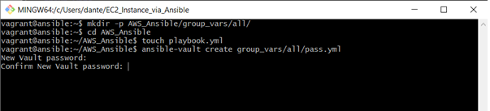
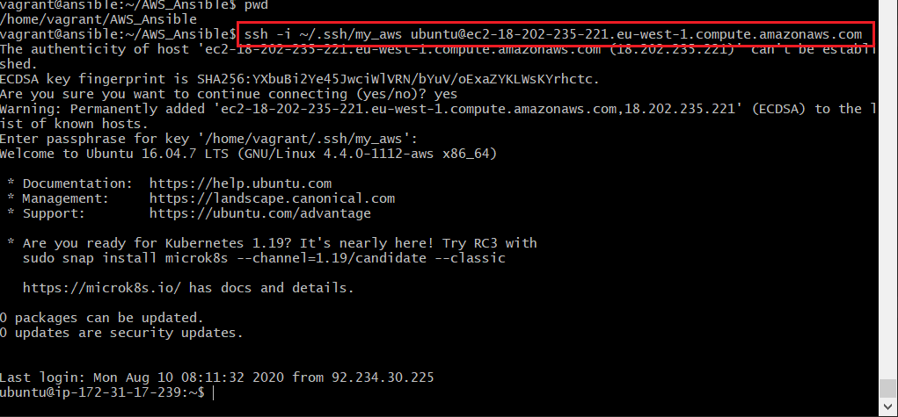

# Creating an EC2 Instance via Ansible

##### 1) First, spin up a Virtual Machine. I have created a VM called Ansible in this demonstration.

##### 2) Then ssh inside the virtual machine previously created. ``` vagrant ssh ansible ```

##### 3) Once inside go ahead and install all Pre-requisites needed for Ansible. The commands can be seen below:

```
sudo apt update

sudo apt install software-properties-common

sudo apt-add-repository --yes --update ppa:ansible/ansible

sudo apt install ansible
```
##### You can also install tree to present the files in more aesthetically pleasing manner
```
sudo apt-get install tree
``` 

##### 4) Once ansible in installed we can now start downloading the EC2 module dependencies. They can be seen below:
```
sudo apt install python

sudo apt install python-pip -y

sudo pip install --upgrade pip

sudo pip install boto

sudo pip install boto3
```
##### 5) Once all dependencies are installed we can now move on to the SSH key creation.

```
ssh-keygen -t rsa -b 4096 -f ~/.ssh/<Your_Name>_aws
```

##### 6) Now we can create the Ansible directory structure. The code for this can be seen below:
```
mkdir -p AWS_Ansible/group_vars/all/
cd AWS_Ansible
touch playbook.yml
```

##### 7) Now we can edit the vault and store the EC2 secret and access keys
```
ansible-vault create group_vars/all/pass.yml
```

##### You will be prompted to enter a pass phrase 

##### 8) Once inside you will need to click ```i``` in order to insert and then paste in the following code
```
ec2_access_key: <Your_Access_Key>                                     
ec2_secret_key: <Your_Secret_Key>
```


##### Once the keys are added. To exit press ```ESC``` ```SHIFT + : ``` ```W``` ```Q```

##### 9) Next we nano inside our playbook
``` sudo nano playbook.yml ```


##### paste the following code but change the parts where required.

```
# AWS playbook
---

- hosts: localhost
  connection: local
  gather_facts: False

  vars:
    key_name: dan_aws
    region: eu-west-1
    image: ami-0ff3472dfb98219da
    id: "daniel-web-app"
    sec_group: "{{ id }}-sec"

  tasks:

    - name: Facts
      block:

      - name: Get instances facts
        ec2_instance_facts:
          aws_access_key: "{{ec2_access_key}}"
          aws_secret_key: "{{ec2_secret_key}}"
          region: "{{ region }}"
        register: result

      - name: Instances ID
        debug:
          msg: "ID: {{ item.instance_id }} - State: {{ item.state.name }} - Public DNS: {{ item.public_dns_name }}"
        loop: "{{ result.instances }}"

      tags: always


    - name: Provisioning EC2 instances
      block:

      - name: Upload public key to AWS
        ec2_key:
          name: "{{ key_name }}"
          key_material: "{{ lookup('file', '~/.ssh/{{ key_name }}.pub') }}"
          region: "{{ region }}"
          aws_access_key: "{{ec2_access_key}}"
          aws_secret_key: "{{ec2_secret_key}}"

      - name: Create security group
        ec2_group:
          name: "{{ sec_group }}"
          description: "Sec group for app {{ id }}"
          # vpc_id: 12345
          region: "{{ region }}"
          aws_access_key: "{{ec2_access_key}}"
          aws_secret_key: "{{ec2_secret_key}}"
          rules:
            - proto: tcp
              ports:
                - 22
              cidr_ip: 0.0.0.0/0
              rule_desc: allow all on ssh port
        register: result_sec_group

      - name: Provision instance(s)
        ec2:
          aws_access_key: "{{ec2_access_key}}"
          aws_secret_key: "{{ec2_secret_key}}"
          key_name: "{{ key_name }}"
          id: "{{ id }}"
          group_id: "{{ result_sec_group.group_id }}"
          image: "{{ image }}"
          instance_type: t2.micro
          region: "{{ region }}"
          wait: true
          count: 1
          instance_tags:
            Name: Eng67.Daniel.T.EC2onAnsible

      tags: ['never', 'create_ec2']

```

##### 10) Navigate to the directory where your pass.yml file is located.

```
cd /home/vagrant/AWS_Ansible/group_vars/all
```
##### 11) add reading a writing permissions to the pass.yml file

```
sudo chmod 666 pass.yml
```

##### 12) Then navigate back to the root
```
/home/vagrant/AWS_Ansible
```

##### 13 ) Once here run the following command: This will run the playbook and create the EC2 instance

```
ansible-playbook playbook.yml --ask-vault-pass --tags create_ec2
```
##### After the command has been run you should see the following screen


##### We can also now see on AWS 


##### 14) Once the instance has been created we can now ssh inside using the Public DNS (IPv4) created

```
ssh -i ~/.ssh/my_aws ubuntu@ec2-18-202-235-221.eu-west-1.compute.amazonaws.com
```
##### 15) You will be prompted for a pass phrase. This is the same one as you created earlier. And we are now inside the EC2 just created using ansible!


